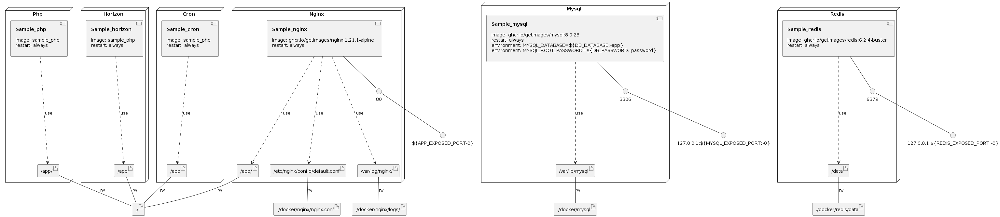

# Laravel Docker-compose

Run Laravel projects (FPM & Octane) using Docker and Docker-compose tools.

## Documentation

```shell
# Download the latest version of Laravel.

# Put the docker-compose files from this repo into the Laravel directory.

cd /path/to/laravel

# Add these variables to .env.example and assign them to proper port numbers.
# APP_EXPOSED_PORT, MYSQL_EXPOSED_PORT, REDIS_EXPOSED_PORT

cp .env.example .env

chmod -R 0777 storage
chmod -R 0777 bootstrap/cache

docker-compose build

# Replace sample_php with your project name in the following commands.

docker run --rm -it --volume $(pwd):/app sample_php composer install
docker run --rm -it --volume $(pwd):/app sample_php php artisan key:generate

# Only if you need to install Horizion:
docker run --rm -it --volume $(pwd):/app sample_php composer require laravel/horizon
docker run --rm -it --volume $(pwd):/app sample_php php artisan horizon:install

# Only if you need to install Octane:
docker run --rm -it --volume $(pwd):/app sample_php composer require laravel/octane
docker run --rm -it --volume $(pwd):/app sample_php php artisan octane:install

docker-compose up -d
docker-compose exec php php artisan migrate
docker-compose ps

# Surf 127.0.0.1:{APP_EXPOSED_PORT} in your web browser.
```

### Docker Images

All the docker images we've used are official images pulled from the Docker Hub and then pushed into GitHub Registry.
You can remove the image base URLs (`ghcr.io/getimages/`) like the example below to use the Docker Hub images instead.

```
GitHub:     ghcr.io/getimages/nginx:1.21.1-alpine
Docker Hub:                   nginx:1.21.1-alpine
```

### Infrastructure model


